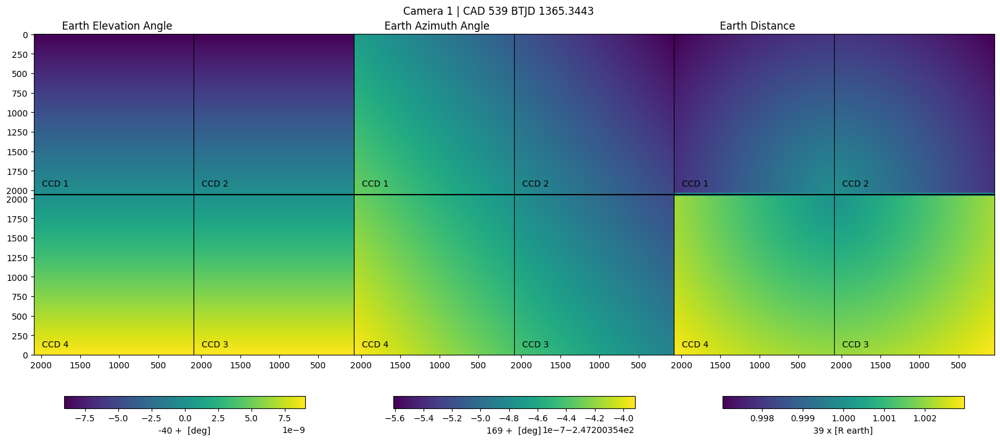

# TESS Back ML

This is a Python package to create training data to be used for a neural network (NN) 
model that predicts the TESS Full Frame Image (FFI) background signal, in particular,
 the time-changing scattered light.

This animation shows the scattered light of a TESS FFI. The original 2048 x 2048 pixel 
image was downsized to 128 x 128 pixels to be memory efficient.

{width=60%}


The next figure shows the vector maps (distance, elevation, and azimuth angles) for 
Earth with respect to the camera boresight. 
Note that the distance maps have a discontinuity between the upper and lower CCDs 
that needs to be fixed.



To get the data follow the steps:

```python
from tess_backml import Background_Data

# initialize the object for given sector/camera/ccd
# will do 16x16 pixel binning
tess_bkg = Background_Data(sector=2, camera=1, ccd=1, img_bin=16, downsize="binning")

# get the flux data from MAST/AWS
tess_bkg.get_flux_data()
# compute the scatter light 
tess_bkg.get_scatter_light_cube()
# compute the vector maps for the Earth and Moon
tess_bkg.get_vector_maps()

# make an animation of the scatter light cube
tess_bkg.animate_flux()

# save data to disk
tess_bkg.save_data()
```