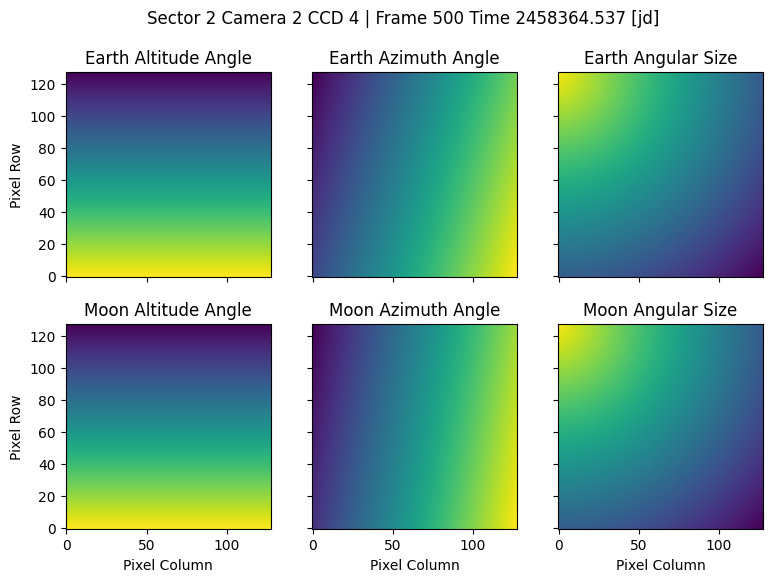

[](https://github.com/jorgemarpa/tess-backml/actions/workflows/pytest.yaml/) [](https://github.com/jorgemarpa/tess-backml/actions/workflows/ruff.yaml)[](https://github.com/jorgemarpa/tess-backml/actions/workflows/deploy-mkdocs.yaml)

# TESS Back ML

This is a Python package to create training data to be used for a neural network (NN) 
model that predicts the TESS Full Frame Image (FFI) background signal, in particular,
 the time-changing scattered light.

This animation shows the scattered light of a TESS FFI. The original 2048 x 2048 pixel 
image was downsized to 128 x 128 pixels to be memory efficient.


The next figure shows the vector maps (distance, elevation, and azimuth angles) for 
Earth and Moon with respect to the camera boresight. These maps have the same shape as
the scatter light cube shown above.



## Install 

Install from this GitHub repository with

```
pip install git+https://github.com/jorgemarpa/tess-backml
```

PyPI will be available soon.

## Usage

To get the data follow the steps:

```python
from tess_backml import Background_Data

# initialize the object for given sector/camera/ccd
# will do 16x16 pixel binning
tess_bkg = BackgroundCube(
    sector=1, camera=1, ccd=1, img_bin=16, downsize="binning"
)

# get the flux data from MAST/AWS, compute scatter light and downsize
tess_bkg.get_scatter_light_cube(plot=False)
# compute the vector maps for the Earth and Moon
tess_bkg.get_vector_maps(ang_size=True)

# make an animation of the scatter light cube
tess_bkg.animate_data(data="sl", save=False, step=10);

# save data to disk
tess_bkg.save_data_npz(save_maps=True)
```

Or you can run a Python script `build_dataset.py` in the terminal (plotting flag is optional and will add
run time):
```
usage: build_dataset.py [-h] [--sector SECTOR] [--camera CAMERA] [--ccd CCD] [--downsize DOWNSIZE] [--image-bin IMG_BIN] [--plot]
                        [--out-dir OUT_DIR]

Build TESS FFI background dataset for a Sector/Camera/CCD.

options:
  -h, --help           show this help message and exit
  --sector SECTOR      TESS sector.
  --camera CAMERA      TESS camera.
  --ccd CCD            TESS camera.
  --downsize DOWNSIZE  Method for downsizing the image, one of [sparse, binning].
  --image-bin IMG_BIN  Image binning size, must divide 2048.
  --plot               Plot target light curve.
  --out-dir OUT_DIR    Outputh directory path where files and figures will be saved.
```
For example
```
python build_dataset.py --sector 3 --camera 1 --ccd 2 --image-bin 16 --downsize binning --plot
```

The script will save `npz` files with the following dictionary:
```
"scatter_cube":   the data cube with the scatter light, shape [nt, 128, 128] depending on the binsize (16)
"time":           time array in JD
"cadenceno":      cadence number array
"earth_alt":      Earth altitude angle from the camera boresight
"earth_az":       Earth azimuth angle from the camera boresight
"earth_dist":     Earth distance from the camera boresight
"moon_alt":       Moon altitude angle from the camera boresight
"moon_az":        Moon azimuth angle from the camera boresight
"moon_dist":      Moon distance from the camera boresight
"earth_alt_map":  Earth altitude angle map for every pixel, same shape as `scatter_cube`
"earth_az_map":   Earth azimuth angle map for every pixel 
"earth_dist_map": Earth angular size map for every pixel 
"moon_alt_map":   Moon altitude angle map for every pixel 
"moon_az_map":    Moon azimuth angle map for every pixel 
"moon_dist_map":  Moon angular size map for every pixel 
```

Also check out the Jupyter notebook tutorial [here](./tutorial_1.ipynb).